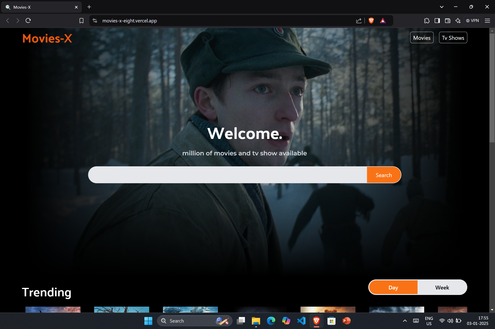
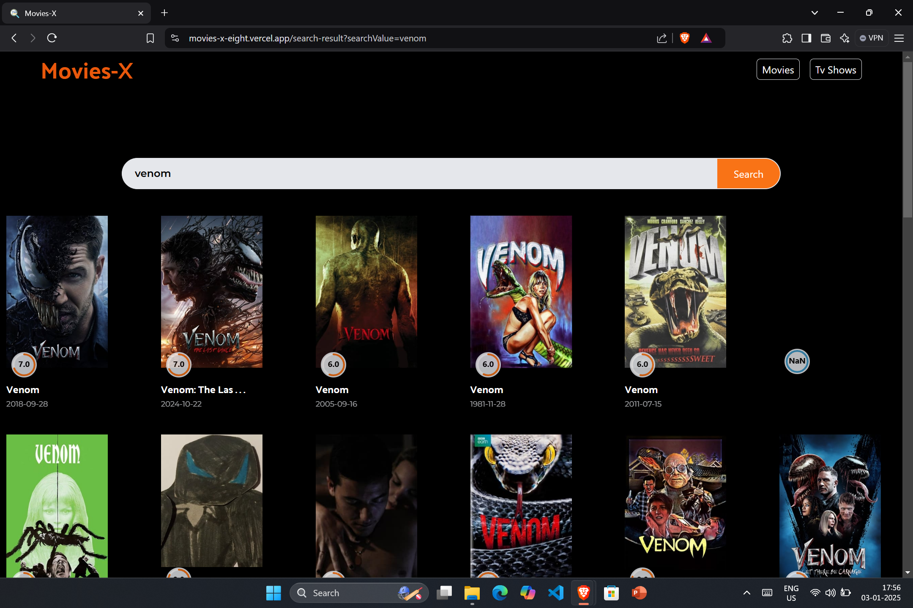
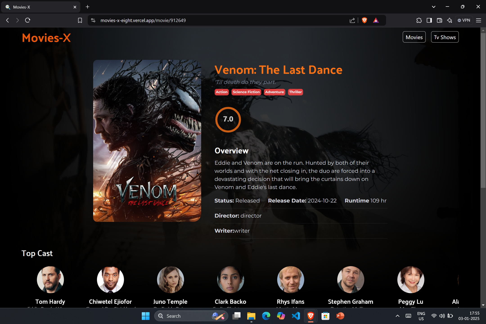

# Movies-X

Movies-X is a web application that allows users to explore and search for movies effortlessly. The application is built with modern web technologies and provides an engaging user experience with infinite scrolling, detailed movie information pages, and a powerful search feature.

---

## Features

### 1. **Movies Home Page**
   - A dynamic homepage displaying a collection of trending or popular movies. 
   - Infinite scrolling for seamless browsing through a large collection of movies.

   

---

### 2. **Search Movies**
   - A search bar to quickly find movies by their title or keywords.
   - Results are displayed instantly with relevant matches.

   

---

### 3. **Individual Movie Information**
   - A dedicated page for each movie displaying detailed information such as title, release date, synopsis, genre, and ratings.
   - High-quality posters and trailers (if available).

   

---

### 4. **Infinite Scroll Implementation**
   - Smooth infinite scrolling to load more movies as the user reaches the end of the page.
   - Optimized for performance to ensure a seamless browsing experience.

   

---

## Technologies Used

- **Frontend**: React.js, Next.js
- **Styling**: Tailwind CSS
- **Backend**: Node.js, Express.js
- **Database**: MongoDB
- **API Integration**: [The Movie Database (TMDb) API](https://www.themoviedb.org/)
- **Version Control**: Git, GitHub

---

## How to Run Locally

1. Clone the repository:
   ```bash
   git clone https://github.com/your-username/movies-x.git
   ```

2. Navigate to the project directory:
   ```bash
   cd movies-x
   ```

3. Install dependencies:
   ```bash
   npm install
   ```

4. Add your TMDb API key to the environment variables:
   ```env
   REACT_APP_TMDB_API_KEY=your_api_key_here
   ```

5. Start the development server:
   ```bash
   npm run dev
   ```

6. Open the application in your browser at `http://localhost:3000`.

---

## Contributing

Contributions are welcome! Please follow these steps:

1. Fork the repository.
2. Create a new branch for your feature or bug fix.
3. Commit your changes and push to the branch.
4. Submit a pull request for review.

---

## Contact

For questions or feedback, please reach out to [amaan.swe@gmail.com].
